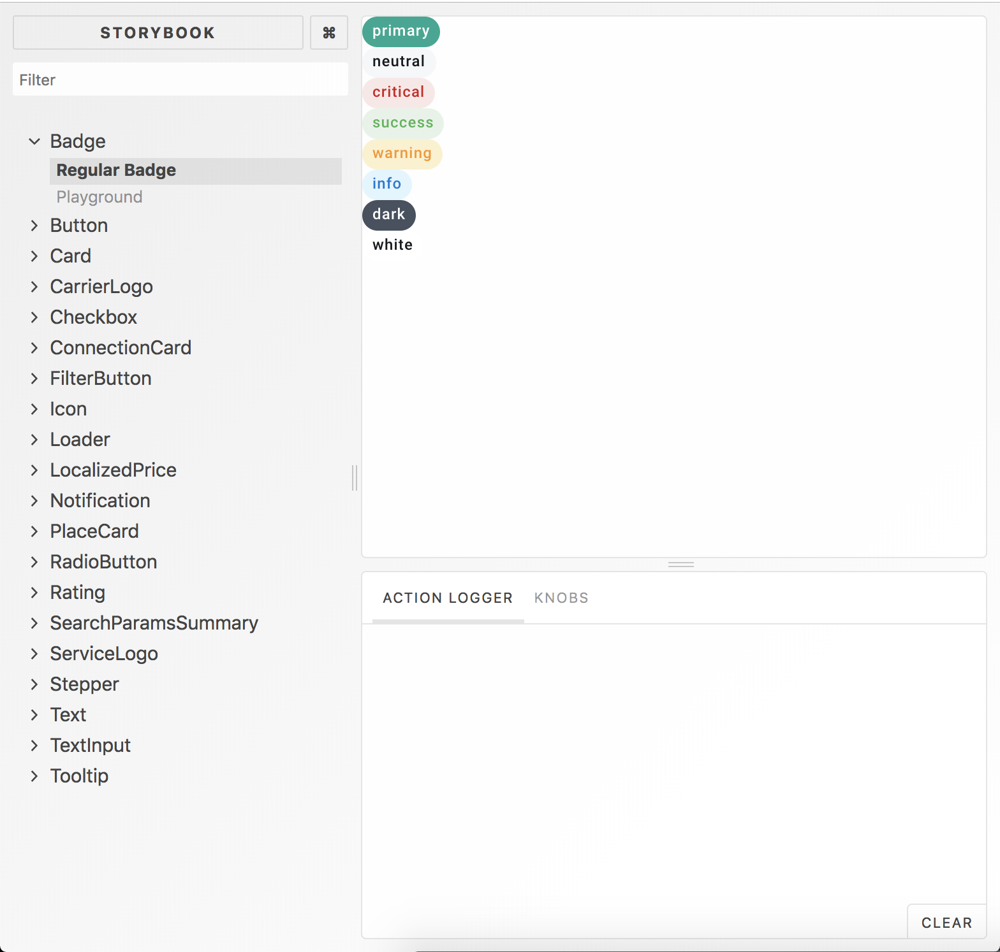
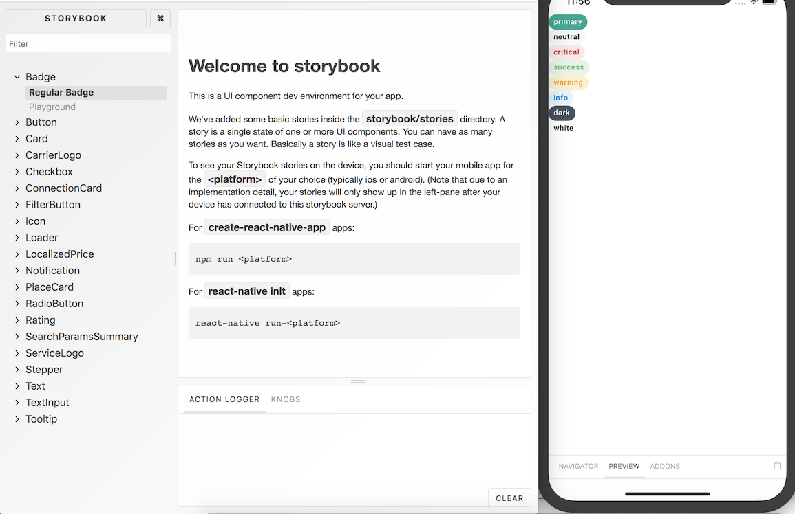

# Contributing Guidelines

_Note: These guidelines assume you have an existing React Native setup on your machine and that your simulator/emulator is properly functionning. If not, have a look at [Getting Started • React Native](https://facebook.github.io/react-native/docs/getting-started.html), and go to "Building Projects with Native Code"._

To run the storybook and start developing, clone the repository

```bash
git clone https://github.com/kiwicom/universal-components.git
```

and enter the directory to install the node modules:

```bash
cd universal-components
yarn
```

## Desktop

If you want to see the web version, run

```bash
yarn storybook
```

and you should go to <http://localhost:9009> to see



## Mobile

After running `yarn`, you also need to link assets using:

```bash
react-native link
```

### iOS

To run the storybook on iOS, execute

```bash
yarn ios
```

to see 

### Android

To run the storybook on Android, execute

```bash
yarn android
```

### Easier navigation

Although it is possible to navigate using the menu inside the mobile storybook, there is a navigator inside the browser available at <http://localhost:7007> after you run

```bash
yarn storybook-native
```

You should see something similar to 

and it is then easier to test the interactions with the action logger, and play with the knobs inside the Playground.

## Troubleshooting

- **I added `MyComponent.stories.js` and it is not available on iOS or Android in the storybook, but I can see it on the web version.**<br>
  This is sometimes due to the fact that `react-native-story-loader` did not run. To fix it, execute

  ```bash
  yarn rnstl
  ```

- **I started the web UI for the mobile storybook but no stories are displayed.**<br>
  Make sure that the packager is running (`yarn ios` or `yarn android`), and refresh the application by pressing `CMD+R` on iOS or by pressing `R` twice on `Android`.

## Before submitting a PR: a checklist

- I tested my component at least on iOS or on Android;
- I wrote tests for my component and all tests are passing;
- I ran `yarn test-ci` and there were no errors;
- I squashed all my commits into one (unless having several really makes sense);
- I chose a descriptive message for all my commit messages ([check commit message convention](#commit-message-convention));
- I created my PR and added reviewers.

### Commit message convention

- Commit message should contain also proper description, once you open a PR it will be added automatically to PR description.

- We prefix our commit messages with one of the following to signify the kind of change:

  - `fix`: bug fixes, e.g. fix some colors, paddings.
  - `feat`: new features, e.g. add new component.
  - `refactor`: code/structure refactor, e.g. new structure folder for components/ extracting component to separate file.
  - `docs`: changes into documentation,
  - `test`: adding or updating tests, e.g. unit, snapshot testing.
  - `chore`: tooling changes, e.g. change circle ci config.
  - `BREAKING`: for changes that break existing usage, e.g. change API of a component.

## Updating Icons

If you need to update the icon list (`Icon/icons.json`), make sure to run

```bash
node scripts/generateTypes.js
```

to update `src/types/_generated-types/index.js`. This ensures flow types are accurate.

## Style Guide

### Writing flow types in different files

When writing `flow` types, leave them as close to the component as possible, ideally in the same file. They should be written just after the imports and before the component declaration.

However, since this is a multi-platform component library, if some types need to be reused in different files specific to each platform, the accepted practice is to extract said types into a file `ComponentTypes.js` in the same `Component` folder. They would typically consist of `Props` and `State` types.

> For instance, have a look at [Checkbox](./src/Checkbox). Since we have a `Checkbox.native.js` file and a `Checkbox.web.js` file, we need to extract the common types into `CheckboxTypes.js`. However, `CheckboxShared.js` is a cross-platform component and it contains its types inside the same file.

If you need to import types in other components, the convention is to do the following:

```javascript
import type { Props as ComponentProps } from '../Component/Component';
```
