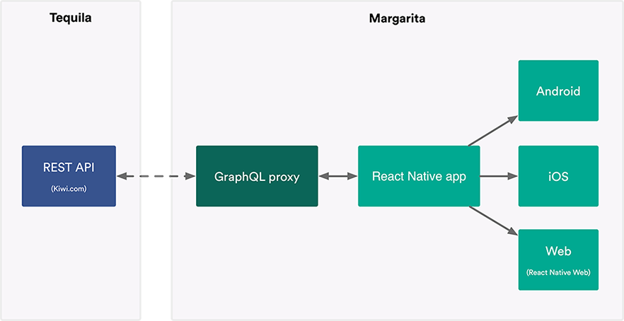

  

<h1 align="center">Margarita</h1>

<h4 align="center">⚠️ This project is not actively maintained ⚠️</h4>

<h4 align="center">Multi-platform ✈️ travel app  for iOS, Android and Web </h4>

 
built with <strong>React Native, GraphQL and <a href="https://partners.kiwi.com/presenting-tequila-revolution-travel-industry/" target="_blank">Tequila API</a></strong>

## Demo

- **Web version**: https://kiwicom-margarita.netlify.com
- Project in Expo: https://expo.io/@kiwicom-margarita-public/margarita-mobile

**If you like this project**, please give us ⭐ on GitHub — it helps!

  
  
  

## Devstack

This project follows the react-native-web philosophy of **Write Once, Render Anywhere**.

- [React Native](https://facebook.github.io/react-native/)
- [Expo](https://expo.io/)
- [React Native Web](https://github.com/necolas/react-native-web)
- [Next.js](https://nextjs.org/)
- [Relay](http://facebook.github.io/relay/)
- [Flow](https://flow.org/)

More detailed info about our devstack can be found in [Technical Overview docs](https://kiwicom.github.io/margarita/docs/technical-overview).

## App features

The app consists of 4 main parts which should cover the whole searching and booking flow:

- Search for connections
- Booking
- Manage my booking
- Payments

More detailed info can be found in the [Features docs](https://kiwicom.github.io/margarita/docs/features).

## Documentation

- **[Getting Started](https://kiwicom.github.io/margarita/docs/getting-started)**
- [Tequila API](https://kiwicom.github.io/margarita/docs/tequila-api)
- [Contributing](https://kiwicom.github.io/margarita/docs/contributing)

Full documentation for **Margarita** can be found on [kiwicom.github.io](https://kiwicom.github.io/margarita/docs/).

## How it works

## Links

- 🎮 [GraphQL Playground](https://p2kwd3i3a8.execute-api.eu-central-1.amazonaws.com/staging/graphql)
- 🚀 [GraphQL Voyager](https://margarita-graphql-voyager.now.sh/)
- 📘 [Storybook for Universal components](https://kiwicom-universal-components.netlify.com)
- 🍸 [Margarita product page](http://margarita.kiwi.com)
- 🥝 [Open source projects at Kiwi.com](https://github.com/kiwicom/)

## License

The code in this project is licensed under [MIT license](LICENSE). By contributing to Margarita, you agree that your contributions will be licensed under its MIT license.
