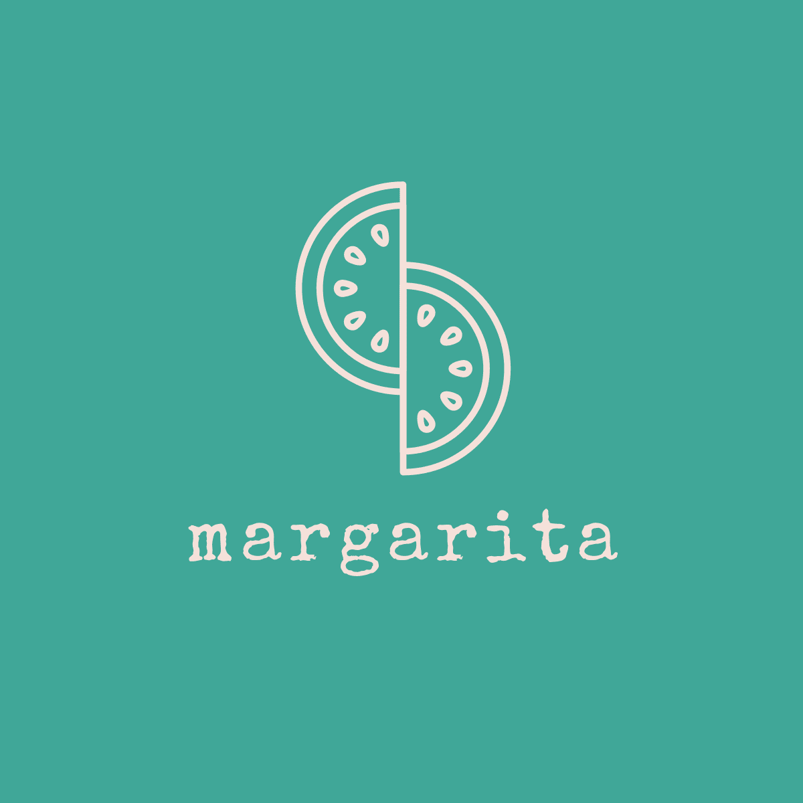

TODO:

- yarn workspaces



# Margarita
> Showcasing the power of [Tequila](https://partners.kiwi.com/presenting-tequila-revolution-travel-industry/)

This project is a living example of a client app you could start building with Tequila.

## Installing / Getting started

To get started, clone the repository, change directory and install the dependencies:

```shell
git clone git@github.com:kiwicom/margarita.git
cd margarita/
yarn install
```

To launch the app, you have different options:
- `yarn dev` to launch the _development_ web version;
- `yarn build; yarn start` to launch the _production_ web version;
- `yarn ios` or `yarn android` to start the mobile version.

The other available scripts are:
- `yarn analyze` to get an analysis of the bundle size to get the following


- `yarn lint` to ensure your code is properly formatted;
- `yarn flow` to ensure your code is respecting the types given to your vaiables;
- `yarn test-ci` to ensure your code should pass the Continuous Integration (CI) tests;
- `yarn relay` to get the latest schema of the [graphql server](packages/graphql) 
and compile your queries and fragments to generate Flow types, among other things.


### Initial Configuration

@TODO

## Developing

### Considerations

This project follows `react-native-web`'s philosophy of ["Write Once, Render Anywhere"](https://www.youtube.com/watch?v=HLWM2uhv2wI). The web version is powered by
[Next.js](https://github.com/zeit/next.js/) and the mobile version is powered by 
[Expo](https://github.com/expo/expo).

@TODO

### Building

@TODO

### Deploying / Publishing

>CAVEAT: This is a demo app.

@TODO

## Features

What's all the bells and whistles this project can perform?
* Users can search and book flights; (@TODO)
* Users can manage their bookings; (@TODO)

## Configuration

Here you should write what are all of the configurations a user can enter when
using the project.

@TODO

## Contributing

If you'd like to contribute, please fork the repository and use a feature
branch. Pull requests are warmly welcome.

> NOTE: Note this is only meant as an example app and even though we take
pride in the quality of our work, features should not be assumed to be 
production-ready.

To ensure code quality, make sure to run `yarn test-ci` and fix the potential
errors before pushing your code. See [above](#installing-/-getting-started) for a description of what it does.

## Links

Here are a few links that could be helpful:

- Presenting Tequila: https://partners.kiwi.com/presenting-tequila-revolution-travel-industry/
- Tequila Portal: https://tequila.kiwi.com/portal
- Repository: https://github.com/kiwicom/margarita/
- Issue tracker: https://github.com/kiwicom/margarita/issues
  - In case of sensitive bugs like security vulnerabilities, please contact
    tequila-support@kiwi.com directly instead of using issue tracker. We value your effort
    to improve the security and privacy of this project!
- Awesome README starter: https://github.com/jehna/readme-best-practices


## Licensing

The code in this project is licensed under [MIT license](LICENSE). By contributing to Margarita, you agree that your contributions will be licensed under its MIT license.