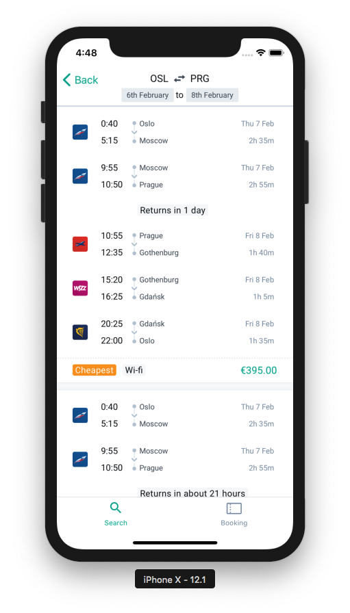

<div align="center">

</div>

# Margarita

> Showcasing the power of [Tequila](https://partners.kiwi.com/presenting-tequila-revolution-travel-industry/)

This project is a living example of a client app you could start building with Tequila.

- 🕸️ Web version: https://kiwicom-margarita.netlify.com
- 🎮 GraphQL Playground https://p2kwd3i3a8.execute-api.eu-central-1.amazonaws.com/staging/graphql
- 🚀 GraphQL Voyager: https://margarita-graphql-voyager.now.sh/

<div align="center">



</div>

## Installing / Getting started

To get started, clone the repository, change directory and install the dependencies:

```shell
git clone https://github.com/kiwicom/margarita
cd margarita/
yarn
```

To launch the GraphQL server:

- `yarn server`

To launch the client app, you have different options:

- `yarn web` to launch the _development_ web version;
- `yarn export; yarn build; yarn start` to launch the _production_ web version;
- `yarn mobile` to start the mobile version.

> Note: If `yarn server` is running and you get Network errors on Android, you need to forward your localhost:4000 to the emulator; this is achieved by running `adb reverse tcp:4000 tcp:4000`.

The other available scripts are:

- `yarn web:analyze` to get an analysis of the bundle size to get the following
  
- `yarn dev` to run concurrently `yarn server` and `yarn web`;
- `yarn lint` to ensure your code is properly formatted;
- `yarn flow` to ensure your code is respecting the types given to your vaiables;
- `yarn test` to run the test suites;
- `yarn test-ci` to ensure your code should pass the Continuous Integration (CI) tests;
- `yarn relay` to get the latest schema of the [graphql server](apps/graphql)
  and compile your queries and fragments to generate Flow types, among other things;
- `yarn landing-page` to run the landing page of the app;
- `yarn docs` to run the documentation website, available at http://localhost:1337;
- `yarn voyager` to run the Voyager (represents the GraphQL types as an interactive graph), available at http://localhost:3002;
- `storybook:web:margarita-components` to run the web version of the Storybook for `@kiwicom/margarita-components`, available at http://localhost:9009;
- `storybook:mobile:margarita-components` to run the mobile version of the Storybook for `@kiwicom/margarita-components`, available at http://localhost:7007 for the web UI controlling the Storybook Expo application;
- `storybook:web:universal-components` to run the web version of the Storybook for `@kiwicom/universal-components`, available at http://localhost:9009;
- `storybook:mobile:universal-components` to run the mobile version of the Storybook for `@kiwicom/universal-components`, available at http://localhost:7007 for the web UI controlling the Storybook Expo application.

### Initial Configuration

1. Copy and rename following sample files:

   - .env-sample &rightarrow; **.env**
   - apps/graphql/.env-sample &rightarrow; **apps/graphql/.env**

2. Set environment variables in files:

   **.env**:

   - `GRAPHQL_URL`
     - URL of GraphQL server
     - E. g.: `'http://127.0.0.1:4000'`

   **apps/graphql/.env**:

   - `API_KEY`
     - Get your API key here: https://tequila.kiwi.com
   - `BASE_URL`
     - URL of REST server
     - E. g.: `'https://kiwicom-test.apigee.net/'`
   - `NODE_ENV`
     - Type of NodeJS environment.
     - E. g.: `'development'`

## Developing

### Considerations

This project follows `react-native-web`'s philosophy of ["Write Once, Render Anywhere"](https://www.youtube.com/watch?v=HLWM2uhv2wI). The web version is powered by
[Next.js](https://github.com/zeit/next.js/) and the mobile version is powered by
[Expo](https://github.com/expo/expo).

@TODO

### Building

@TODO

### Deploying / Publishing

> CAVEAT: This is a demo app.

@TODO

## Features

What's all the bells and whistles this project can perform?

- Users can search and book flights; (@TODO)
- Users can manage their bookings; (@TODO)

## Configuration

Here you should write what are all of the configurations a user can enter when
using the project.

@TODO

## Contributing

If you'd like to contribute, please fork the repository and use a feature
branch. Pull requests are warmly welcome.

> NOTE: Note this is only meant as an example app and even though we take
> pride in the quality of our work, features should not be assumed to be
> production-ready.

To ensure code quality, make sure to run `yarn test-ci` and fix the potential
errors before pushing your code. See [above](#installing-/-getting-started) for a description of what it does.

## Links

Here are a few links that could be helpful:

- Presenting Tequila: https://partners.kiwi.com/presenting-tequila-revolution-travel-industry/
- Tequila Portal: https://tequila.kiwi.com/portal
- Repository: https://github.com/kiwicom/margarita/
- Issue tracker: https://github.com/kiwicom/margarita/issues
  - In case of sensitive bugs like security vulnerabilities, please contact
    tequila-support@kiwi.com directly instead of using issue tracker. We value your effort
    to improve the security and privacy of this project!
- Awesome README starter: https://github.com/jehna/readme-best-practices

## Licensing

The code in this project is licensed under [MIT license](LICENSE). By contributing to Margarita, you agree that your contributions will be licensed under its MIT license.
