Margarita is heavily inspired by our <a href="http://kiwi.com" target="_blank">Kiwi.com</a> mobile and web apps. We want to create a full-fledged production ready app for developers, entrepreneurs and companies who want to use our API.

## Supported Features

Margarita is split into 4 parts or functional domains:

- [Search for connections](features#search-for-connections)
- [Booking](features#booking)
- [Manage my booking](features#manage-my-booking)
- [Payments](features#payments)

### Search for connections

Get an access to the database of 15 billion connections virtually interlined by <a href="http://kiwi.com" target="_blank">Kiwi.com</a>.

#### Search form

- The initial screen of the whole app. The user can set here all the options about the connection he is looking for, such as the departure date, the place of origin, etc.

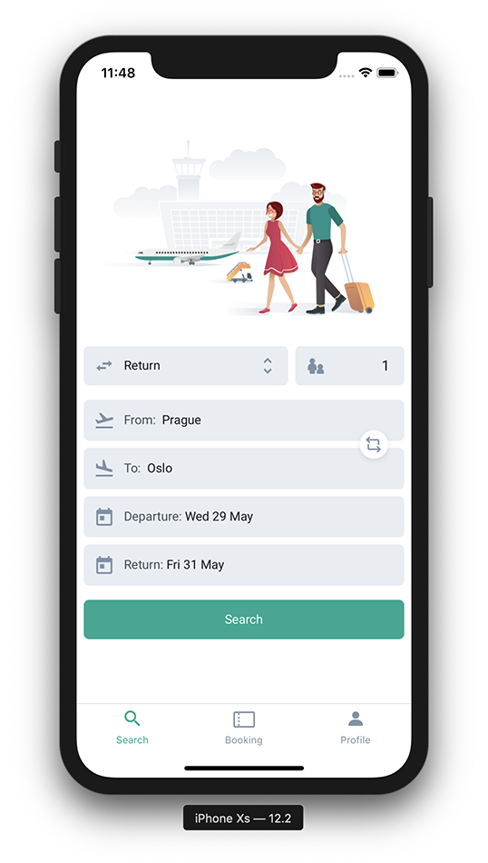
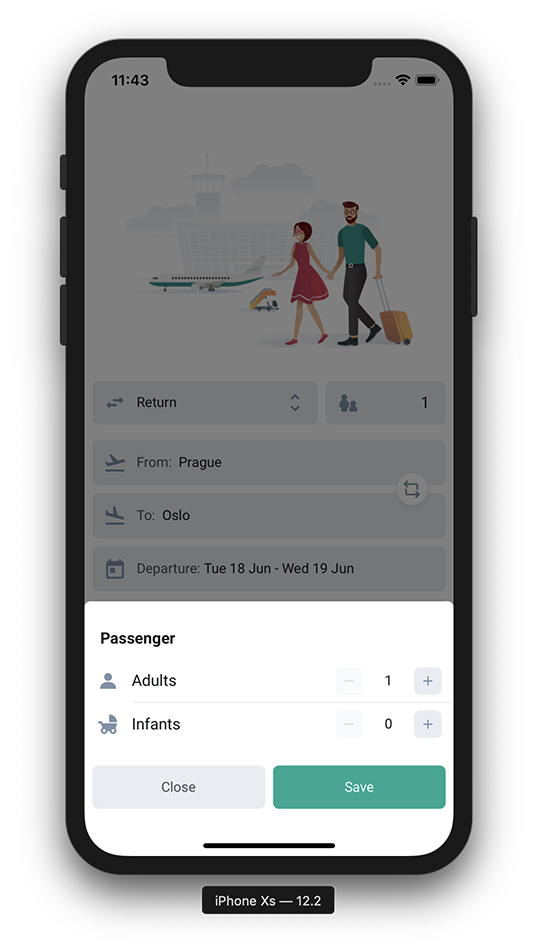
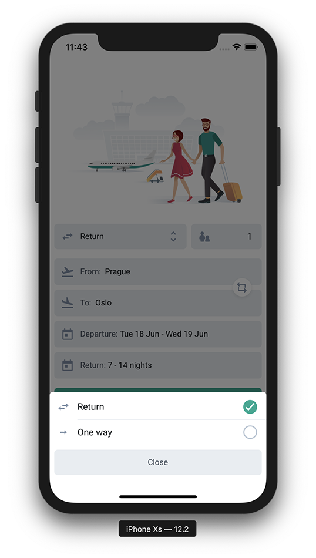

#### Calendar

- The user can choose whether he wants a single date, a range of dates, or specify how many nights he wants to stay in the selected destination

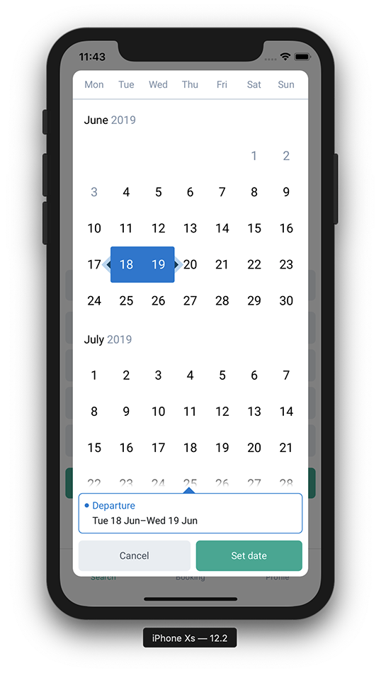
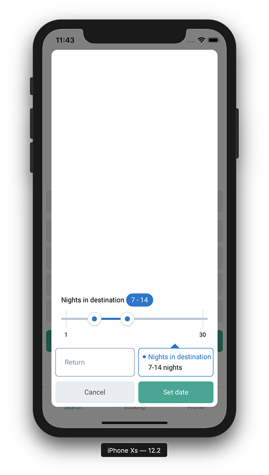

#### Place Picker

- We use Tequila for searching and also showing place suggestions in the input field when inputting places.

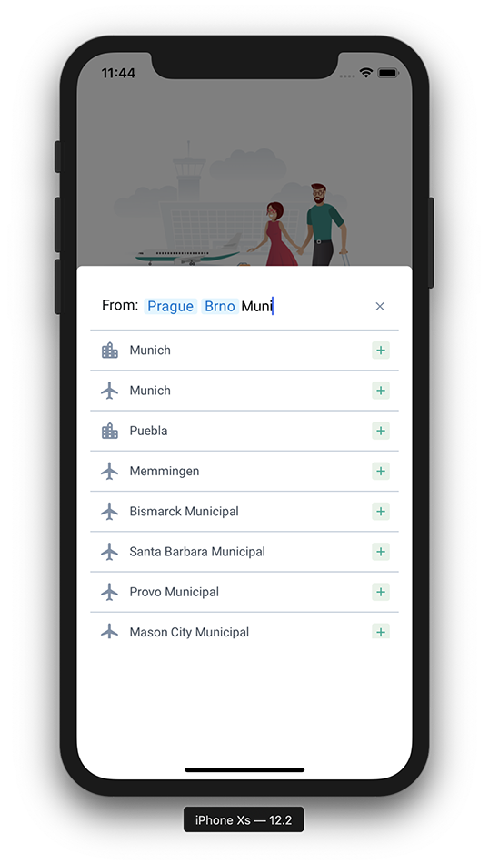

#### Results

- When the user chooses an option, the card is expanded for showing more information about the given connection.

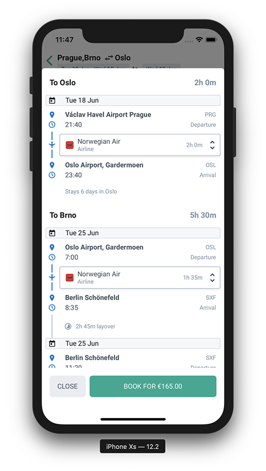
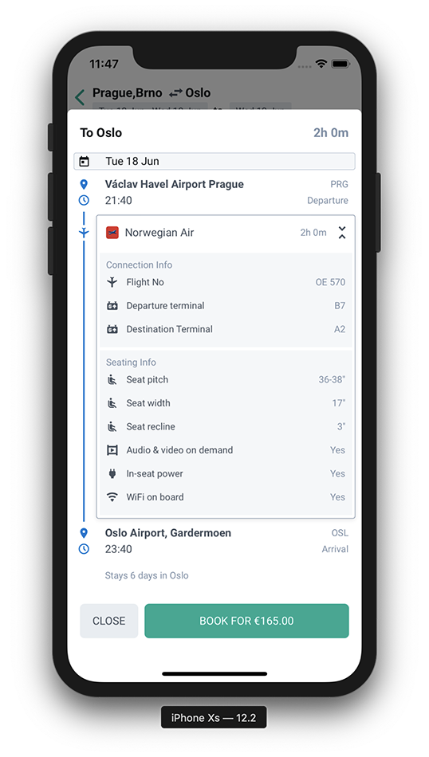

### Booking

Use our powerful infrastructure to book the trips and gain your commission - the best one in the industry.

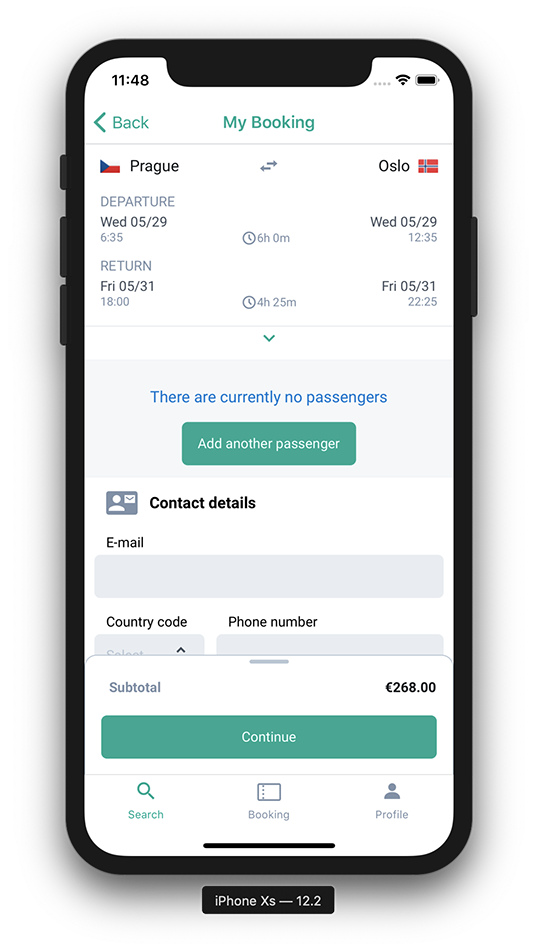
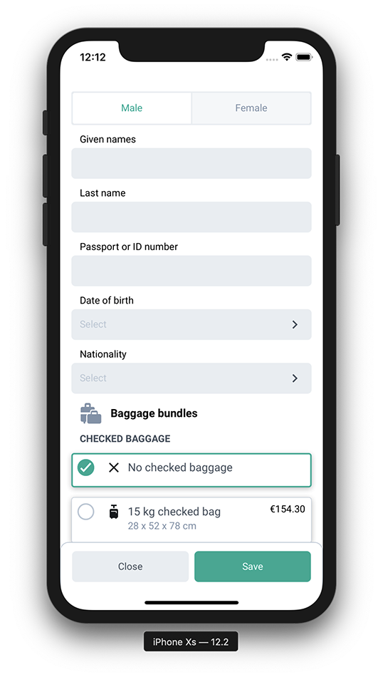

### Manage my booking

Manage my booking allows users to modify the trip, edit passenger’s details or purchase additional services.

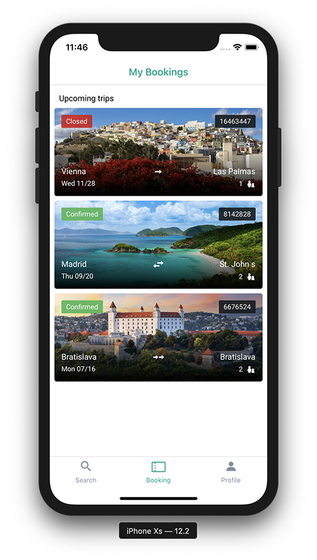

#### Booking detail

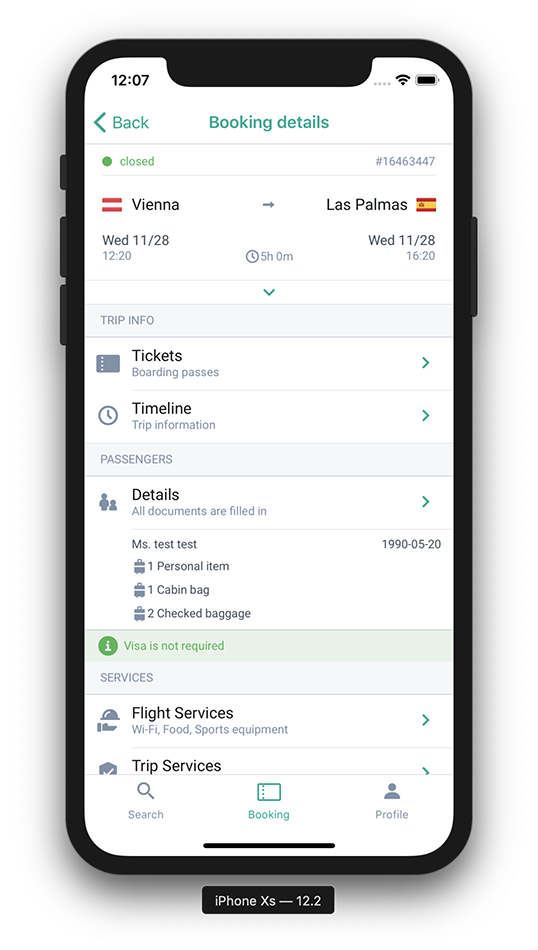
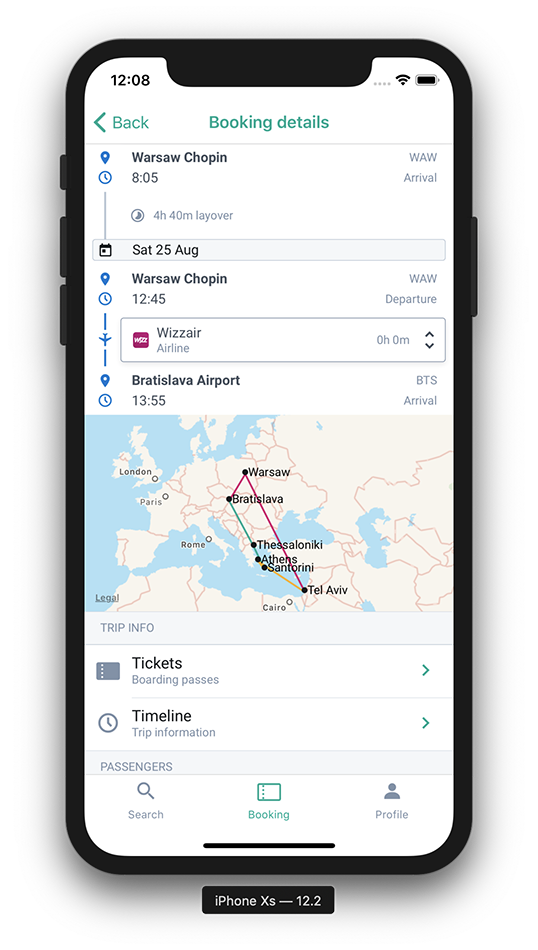
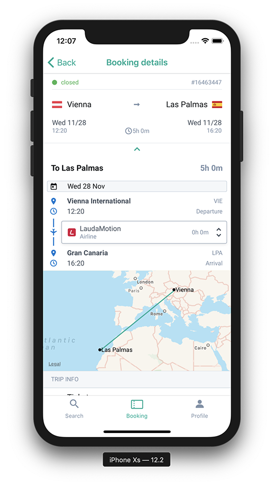

### Payments

Payments allow your users to pay instantly for their bookings, right within the app.

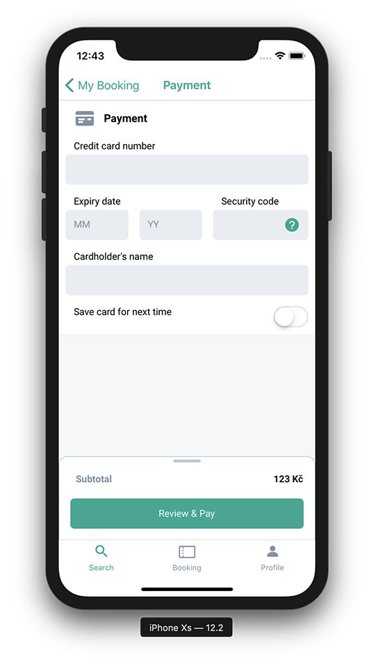

**Did you find a bug? Or do you miss any important feature in Margarita?**

Please <a href="https://github.com/kiwicom/margarita/issues/new/choose" target="_blank">create an issue on GitHub</a>.
