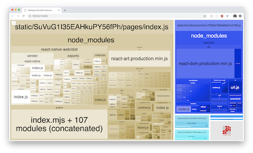

To get started, clone the repository, change directory and install the dependencies:

```shell
git clone https://github.com/kiwicom/margarita
cd margarita/
yarn
```

## Initial Configuration: setting environment variables

1. Copy and rename following sample files:

   - .env-sample &rightarrow; **.env**
   - apps/graphql/.env-sample &rightarrow; **apps/graphql/.env**

2. Set environment variables in files:

   **.env**:

   - `GRAPHQL_URL`
     - URL of GraphQL server
     - E. g.: `'http://127.0.0.1:4000/graphql'`
   - `FIREBASE_API_KEY`
   - `FIREBASE_AUTH_DOMAIN`
   - `FIREBASE_DATABASE_URL`
   - `FIREBASE_PROJECT_ID`
   - `FIREBASE_STORAGE_BUCKET`
   - `FIREBASE_MESSAGING_SENDER_ID`
     - Variables for sample Firebase implementation
     - **Optional** - can be left empty 
     - More info: [Guide: Firebase implementation](./guide-firebase-user)
   - `GOOGLE_OAUTH_IOS`
   - `GOOGLE_OAUTH_ANDROID`
     - Variables for user Google login in native version
     - **Optional** - can be left empty 
     - More info: [Guide: Firebase implementation](./guide-firebase-user)
   - `SITE_ID`
     - Used for Netlify deploys (previously no support for Monorepo multi-deploys)
     - for Margarita: `SITE_ID=@kiwicom/margarita-web`
     - for Storybook: `SITE_ID=@kiwicom/universal-components`

   **apps/graphql/.env**:

   - `API_KEY`
     - Get your API key here: https://tequila.kiwi.com
   - `BASE_URL`
     - URL of REST server
     - E. g.: `'https://kiwicom-test.apigee.net/'`
   - `NODE_ENV`
     - Type of NodeJS environment.
     - E. g.: `'development'`

## Available scripts

To launch the GraphQL server:

- `yarn server`

To launch the client app, you have different options:

- `yarn web` to launch the _development_ web version;
- `yarn export; yarn build; yarn start` to launch the _production_ web version;
- `yarn mobile` to start the mobile version.

**Note**: If `yarn server` is running and you get Network errors on Android, you might need to forward your localhost:4000 to the emulator; this is achieved by running `adb reverse tcp:4000 tcp:4000`.

The other available scripts are:

- `yarn web:analyze` to get an analysis of the bundle size to get the following
  
- `yarn dev` to run concurrently `yarn server` and `yarn web`;
- `yarn lint` to ensure your code is properly formatted;
- `yarn flow` to ensure your code is respecting the types given to your vaiables;
- `yarn test` to run the test suites;
- `yarn test-ci` to ensure your code should pass the Continuous Integration (CI) tests;
- `yarn relay` to get the latest schema of the [graphql server](https://github.com/kiwicom/margarita/tree/master/apps/graphql)
  and compile your queries and fragments to generate Flow types, among other things;
- `yarn landing-page` to run the landing page of the app;
- `yarn docs` to run the documentation website, available at http://localhost:1337/margarita/;
- `yarn voyager` to run the Voyager (represents the GraphQL types as an interactive graph), available at http://localhost:3002;
- `storybook:web:margarita-components` to run the web version of the Storybook for `@kiwicom/margarita-components`, available at http://localhost:9009;
- `storybook:mobile:margarita-components` to run the mobile version of the Storybook for `@kiwicom/margarita-components`, available at http://localhost:7007 for the web UI controlling the Storybook Expo application;
- `storybook:web:universal-components` to run the web version of the Storybook for `@kiwicom/universal-components`, available at http://localhost:9009;
- `storybook:mobile:universal-components` to run the mobile version of the Storybook for `@kiwicom/universal-components`, available at http://localhost:7007 for the web UI controlling the Storybook Expo application.
