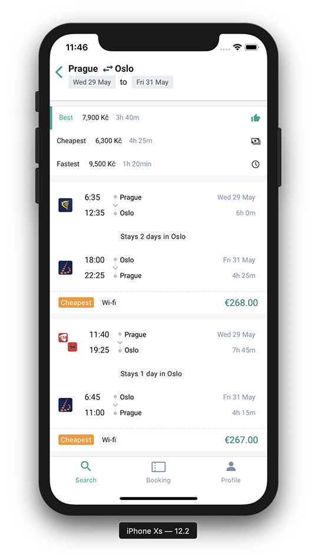
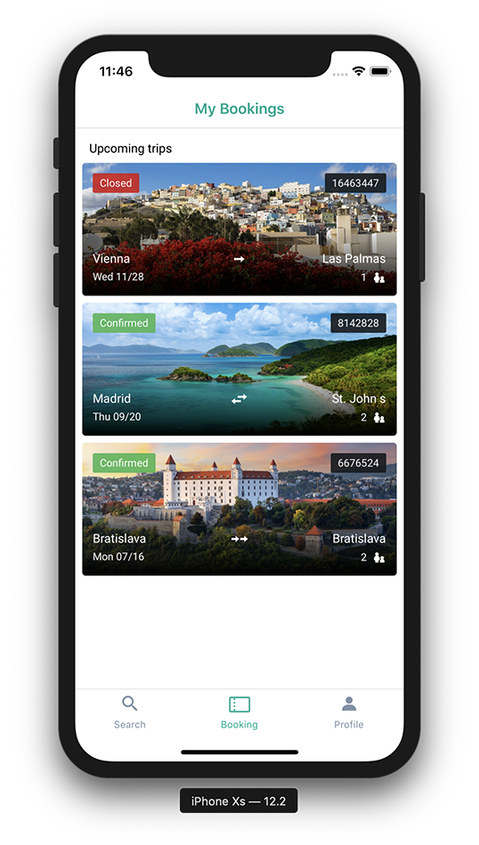

# Margarita

> Showcasing the power of [Tequila](https://partners.kiwi.com/presenting-tequila-revolution-travel-industry/)

This project is a living example of a client app you could start building with Tequila.

- 🕸️ Web version: https://kiwicom-margarita.netlify.com
- 🎮 GraphQL Playground https://p2kwd3i3a8.execute-api.eu-central-1.amazonaws.com/staging/graphql
- 🚀 GraphQL Voyager: https://margarita-graphql-voyager.now.sh/

