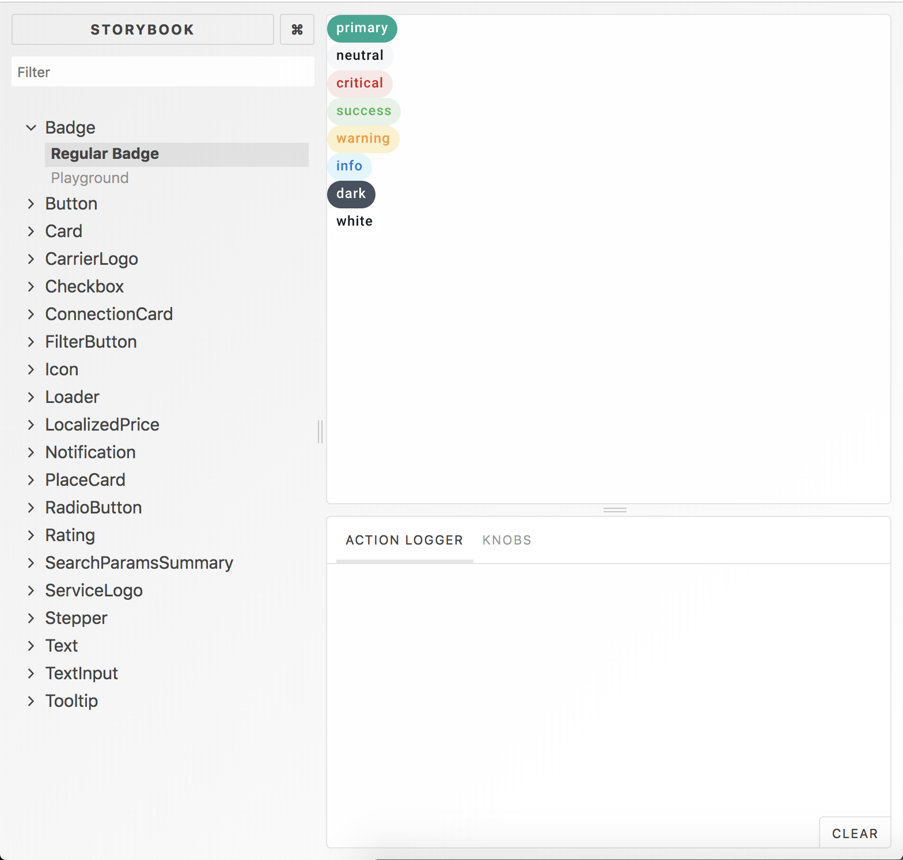
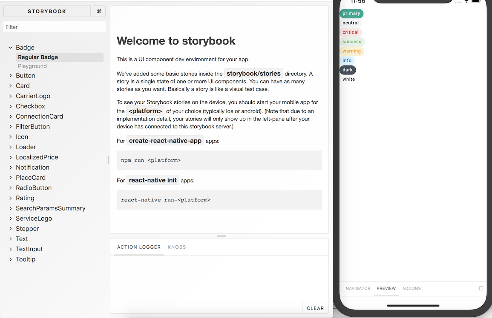

_Note: These guidelines assume you have an existing React Native setup on your machine and that your simulator/emulator is properly functionning. If not, have a look at [Getting Started • React Native](https://facebook.github.io/react-native/docs/getting-started.html), and go to "Building Projects with Native Code"._

## Storybook

To run the storybook and start developing, clone the repository

```bash
git clone https://github.com/kiwicom/margarita.git
```

and enter the directory to install the node modules:

```bash
cd margarita
yarn
```

### Desktop

If you want to see the web version, run

```bash
yarn storybook:web:universal-components
```

and you should go to <http://localhost:9009> to see



### Mobile

If you want to see the mobile version, run

```bash
yarn storybook:mobile:universal-components
```

Open Expo on your device/simulator and use the QR code or URL provided to access the Storybook.

#### Easier navigation

Although it is possible to navigate using the menu inside the mobile Storybook, there is a navigator inside the browser available at <http://localhost:7007> after you run

```bash
yarn storybook:mobile:universal-components
```

You should see something similar to 

and it is then easier to test the interactions with the action logger, and play with the knobs inside the Playground.

## Troubleshooting

- **I added `MyComponent.stories.js` and it is not available on iOS or Android in the storybook, but I can see it on the web version.**<br>
  This is sometimes due to the fact that `react-native-story-loader` did not run. Kill the running process by pressing <kbd>CTRL</kbd>+<kbd>C</kbd> and run the Storybook again:

  ```bash
  yarn storybook:mobile:universal-components
  ```

- **I started the web UI for the mobile storybook but no stories are displayed.**<br>
  Make sure that the packager is running (`yarn storybook:mobile:universal-components`), and refresh the application by pressing <kbd>CMD</kbd>+<kbd>R</kbd> on `iOS` or by pressing <kbd>R</kbd> twice on `Android`. If you use `Physical device`, you can refresh the application by shaking the device and pressing Reload.

  ### Android physical device
  In case refreshing of the application didn't help, try to connect your phone via USB cable with enabled debugging and run
  ```bash
  adb reverse tcp:7007 tcp:7007
  ```
  If you get permisson error check whether you correctly followed [these instructions](https://facebook.github.io/react-native/docs/running-on-device#running-your-app-on-android-devices) and that you set your USB mode to `File Transfer`. Then try refreshing the application again.

- **I modified some components in `packages/universal-components` but they are not updated in Margarita.**<br>
  This is because the files which are resolved when importing anything from `@kiwicom/universal-components` come from `packages/universal-components/lib`. Run
  ```bash
  yarn workspace @kiwicom/universal-components build
  ```
  to create a new `lib` folder with your latest changes.

## Before submitting a PR: a checklist

- I tested my component at least on iOS or on Android;
- I wrote tests for my component and all tests are passing;
- I ran `yarn test-ci` and there were no errors;
- I squashed all my commits into one (unless having several really makes sense);
- I chose a descriptive message for all my commit messages ([check commit message convention](#commit-message-convention));
- I created my PR and added reviewers.

## Commit message convention

- Commit message should contain also proper description, once you open a PR it will be added automatically to PR description.

- We prefix our commit messages with one of the following to signify the kind of change:

  - `Fix`: bug fixes, e.g. fix some colors, paddings.
  - `Feat`: new features, e.g. add new component.
  - `Refactor`: code/structure refactor, e.g. new structure folder for components/ extracting component to separate file.
  - `Docs`: changes into documentation,
  - `Test`: adding or updating tests, e.g. unit, snapshot testing.
  - `Chore`: tooling changes, e.g. change circle ci config.
  - `BREAKING`: for changes that break existing usage, e.g. change API of a component.

**To make this easier**, assuming you are at the root of `margarita` monorepo, please run the following command:

```bash
git config --local commit.template commit-template.txt
```

This will pre-fill your commit message with a [template](https://github.com/kiwicom/margarita/blob/master/commit-template.txt) whenever you run `git commit`, reminding you to follow the convention and to add a summary.

## Updating Icons

If you need to update the icon list (`Icon/icons.json`), make sure to run

```bash
node scripts/generateTypes.js
```

to update `src/types/_generated-types/index.js`. This ensures flow types are accurate.

## Style Guide

### Writing flow types in different files

When writing `flow` types, leave them as close to the component as possible, ideally in the same file. They should be written just after the imports and before the component declaration.

However, since this is a multi-platform component library, if some types need to be reused in different files specific to each platform, the accepted practice is to extract said types into a file `ComponentTypes.js` in the same `Component` folder. They would typically consist of `Props` and `State` types.

> For instance, have a look at [Checkbox](./src/Checkbox). Since we have a `Checkbox.native.js` file and a `Checkbox.web.js` file, we need to extract the common types into `CheckboxTypes.js`. However, `CheckboxShared.js` is a cross-platform component and it contains its types inside the same file.

If you need to import types in other components, the convention is to do the following:

```javascript
import type { Props as ComponentProps } from "../Component/Component";
```
