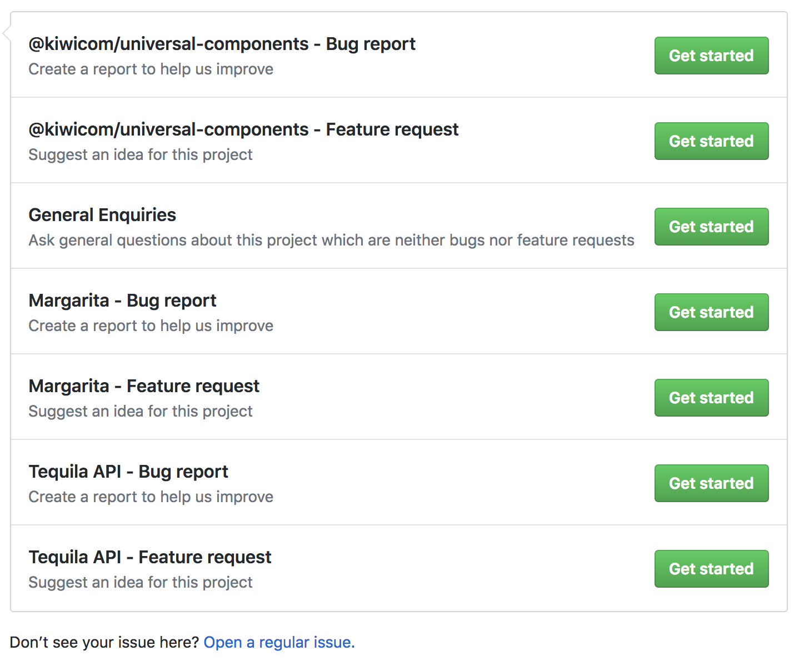

We strive to write the best code we can, but sneaky bugs sometimes find a way to enter the codebase and some functionality can be missing.

_Stumbled upon a bug?_

_Is some feature missing?_

_General question the documentation cannot help you with?_

**Please submit an issue on [GitHub](https://github.com/kiwicom/margarita/issues/new/choose)** (preview below), and choose the most appropriate template.

Fill in the required fields with as much detail as possible and we will do our best to respond shortly.

